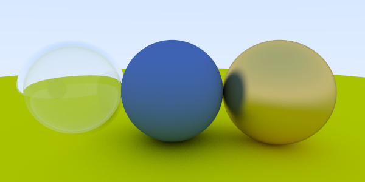
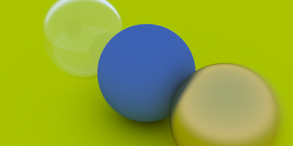
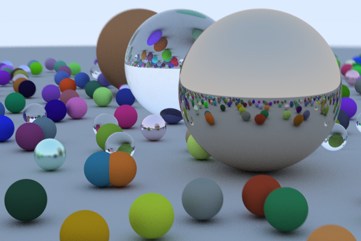
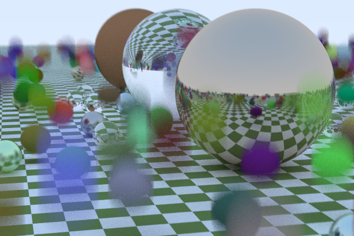
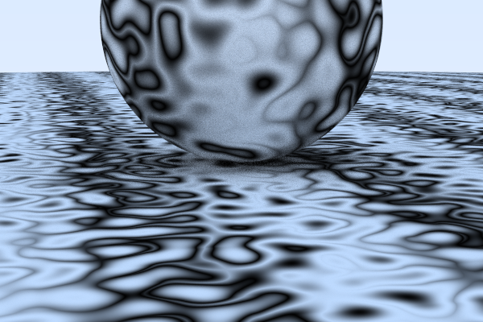
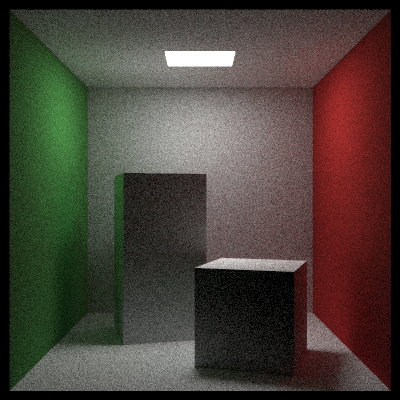
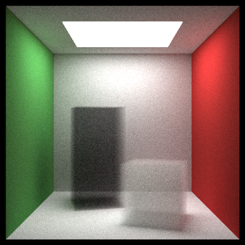

# Ray Tracing in C#
(.NET Core, WPF)

Based on [Peter Shirley's](https://research.nvidia.com/person/peter-shirley) books: 
- ["Ray Tracing in One Weekend (Ray Tracing Minibooks Book 1)"](https://www.goodreads.com/book/show/28794030-ray-tracing-in-one-weekend)
- ["Ray Tracing: the Next Week (Ray Tracing Minibooks Book 2)"](https://www.amazon.com/Ray-Tracing-Weekend-Minibooks-Book-ebook/dp/B01B5AODD8)

## Ray Tracing in One Weekend

### Materials: Diffuse, Metal, Dielectrics

### Defocus Blur

### Cover Scene

## "Ray Tracing the Next Week

### Motion Blur

### Noise Texture

### Simple Room

### Volume

---

Recommended

- [PyGame Ray tracing](https://github.com/Rabbid76/PyGameRayTracing)
- [PeterShirley/raytracing.github.io](https://github.com/RayTracing/raytracing.github.io)
- [PeterShirley/RayTraycingInOneWeekend](https://github.com/RayTracing/InOneWeekend)
- [PeterShirley/RayTraycingTheNextWeek](https://github.com/RayTracing/TheNextWeek)
- [PeterShirley/RayTraycingTheRestOfYourLife](https://github.com/RayTracing/TheRestOfYourLife)